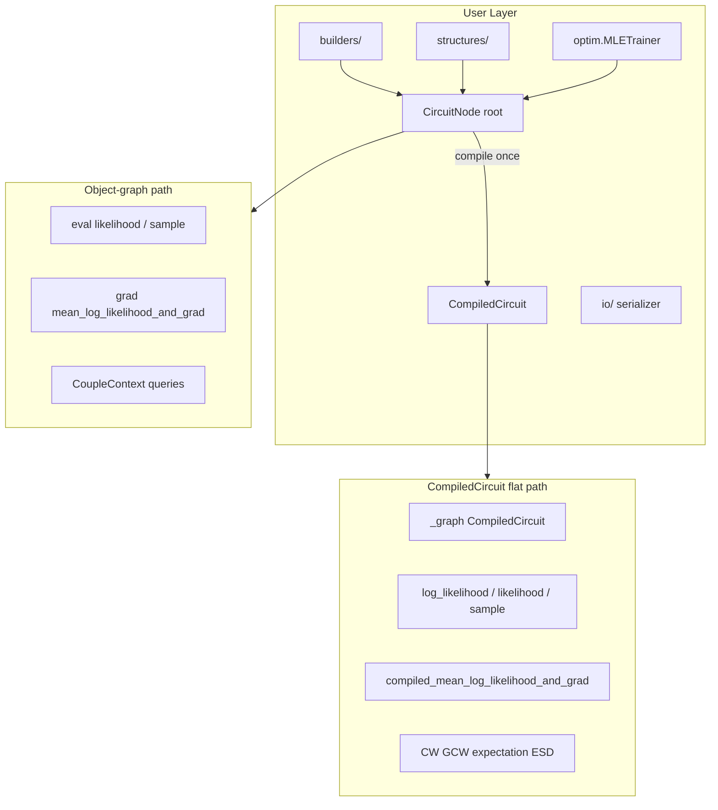

# Architecture

SparC layers a small Python API over a Cython/C++17 core optimized for CPU
inference and differentiable queries.

## Package layout

| Path | Role |
|------|------|
| `sparc/nodes.pyx` | `CircuitNode` types, inference/query API, leaf vtable |
| `sparc/node_clone.py` | Deep-copy helpers |
| `sparc/_graph.pyx` | `CompiledCircuit` flattened layout |
| `sparc/eval.pyx` | Object-graph likelihood / sampling |
| `sparc/grad.pyx` | `GradBundle`, object + compiled gradients |
| `sparc/metrics.pyx` | Pluggable ground metrics |
| `sparc/queries/` | CW, GCW, expectation, ESD |
| `sparc/solvers/` | Transport, Hungarian, NW coupling |
| `sparc/builders/` | Random circuit construction |
| `sparc/structures/` | HMM, HCLT, PD, RAT-SPN, ... |
| `sparc/io/` | JSON serialization |
| `sparc/optim.py` | Simplex-projected optimization |

## Data flow

1. User builds or loads a circuit (`root`).
2. Object-graph queries walk live nodes with memoization.
3. `circuit.compile()` flattens the DAG into `CompiledCircuit` once.
4. Compiled queries use `nogil` numeric cores over CSR arrays; call `refresh_parameters()` after weight updates.
5. Gradients accumulate into `GradBundle` dicts keyed by `node.id`.

## Related handbooks

- [Query engine](query-engine.md)
- [Compiled evaluation](compiled-evaluation.md)
- [Solvers](solvers.md)
