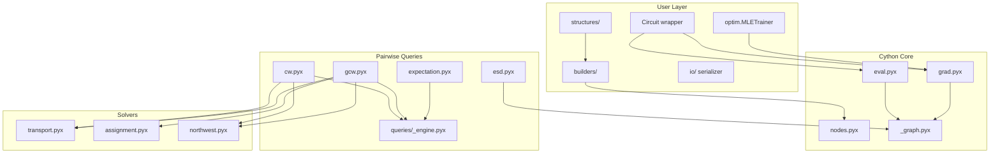

# Architecture

SparC layers a small Python API over a Cython/C++17 core optimized for CPU
inference and differentiable queries.

## Package layout

| Path | Role |
|------|------|
| `sparc/circuit.py` | High-level `Circuit` wrapper |
| `sparc/nodes.pyx` | Node types and leaf vtable |
| `sparc/eval.pyx` | Likelihood, sampling, `CompiledCircuit` |
| `sparc/grad.pyx` | `GradBundle`, MLE gradients |
| `sparc/metrics.pyx` | Pluggable ground metrics |
| `sparc/_graph.pyx` | Flattened `CompiledGraph` for fast paths |
| `sparc/queries/` | CW, GCW, expectation, ESD |
| `sparc/solvers/` | Transport, Hungarian, NW coupling |
| `sparc/builders/` | Random circuit construction |
| `sparc/structures/` | HMM, HCLT, PD, RAT-SPN, ... |
| `sparc/io/` | JSON serialization |
| `sparc/optim.py` | Simplex-projected optimization |

## Node model

- **SumNode**: mixture over children; parameters on the simplex.
- **ProductNode**: product over children with disjoint scopes.
- **InputNode**: leaf with `prob_c` / `sample_into_c` vtable hooks.
- **FiniteDiscreteInputNode**: extends leaves with `support_size` / `pmf_at`
  for Wasserstein and expectation queries.

## Data flow

1. User builds or loads a circuit (`Circuit(root)`).
2. Single-datapoint queries walk the object graph with memoization.
3. Batched evaluation and query fast paths flatten the DAG into
   `CompiledGraph` / `CompiledCircuit` and run `nogil` loops.
4. Gradients accumulate into `GradBundle` dicts keyed by `node.id`.
5. `sparc.optim` projects gradient steps back onto simplices.

## Related handbooks

- [Query engine](query-engine.md)
- [Compiled evaluation](compiled-evaluation.md)
- [Solvers](solvers.md)
