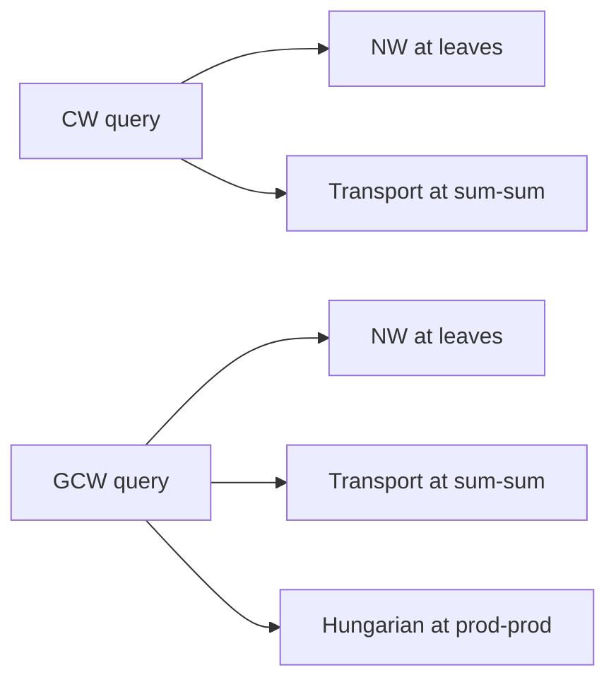

# Solvers

Wasserstein-type queries reduce inner coupling steps to three built-in solvers
under [`sparc.solvers`][sparc.solvers].

## Northwest coupling (`northwest.pyx`)

Builds a monotone coupling plan on the integer line for leaf-leaf CW/GCW
couplings. Used when both sides are finite discrete leaves with a ground metric
cost matrix.

## Transport (`transport.pyx`)

Solves a minimum-cost flow / transportation LP via a network simplex
implementation with dual variables. Sum-sum CW couplings use transport plans;
duals supply subgradients w.r.t. marginal weights.

## Assignment (`assignment.pyx`)

Hungarian algorithm for minimum-cost bipartite matching. GCW uses assignment
at product-product nodes to pair children with minimum cross cost.

## When each solver runs

All solvers are pure Cython/C++ with no runtime dependency beyond NumPy arrays
for exposing results to Python.

Tests in `tests/test_solvers.py` cross-check against SciPy when available.
